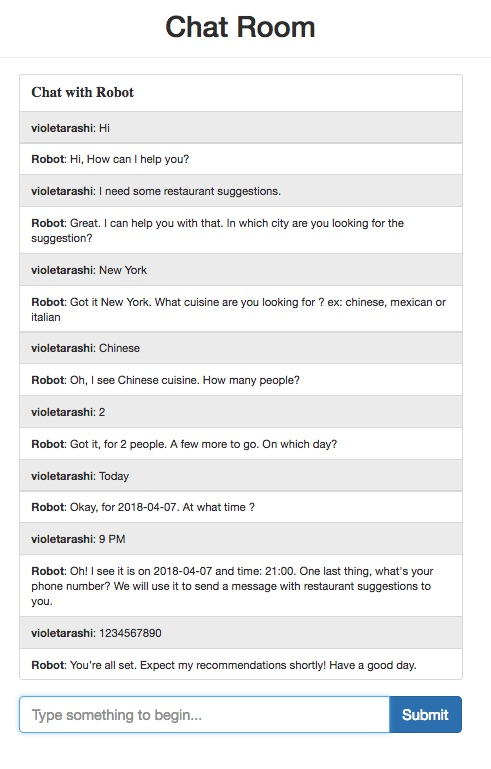

# Chat Robot
Build a Dining Concierge chatbot, that will sms you restaurant suggestions given a set of preferences that you give the chatbot through conversation.

# Tech
AWS, AWS Lambda, AWS LEX, AWS SQS, AWS SNS, AWS cloudwatch, Yelp fusion API

## Team ID: 1
1. Siao-Ting Wang(sw3092)
2. Sriharsha Sammeta(vs2626)

## User Guide
 Chat
 ----
  

## Notes
1. 4 lambda functions in total (required).   
=>LF1: initialization and validation for Lex.   
=>LF-fulfill: push Lex result to SQS during fulfillment step.   
=>LF2: pulling message from SQS every minute and recommending restaurants.   
=>Lambda function from assignment 1

## License

    Copyright 2015 Siao-Ting Wang

    Licensed under the Apache License, Version 2.0 (the "License");
    you may not use this file except in compliance with the License.
    You may obtain a copy of the License at

       http://www.apache.org/licenses/LICENSE-2.0

    Unless required by applicable law or agreed to in writing, software
    distributed under the License is distributed on an "AS IS" BASIS,
    WITHOUT WARRANTIES OR CONDITIONS OF ANY KIND, either express or implied.
    See the License for the specific language governing permissions and
    limitations under the License.
