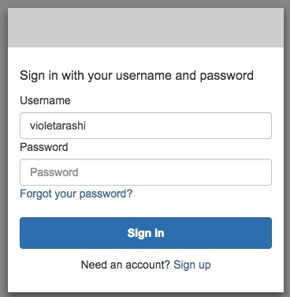
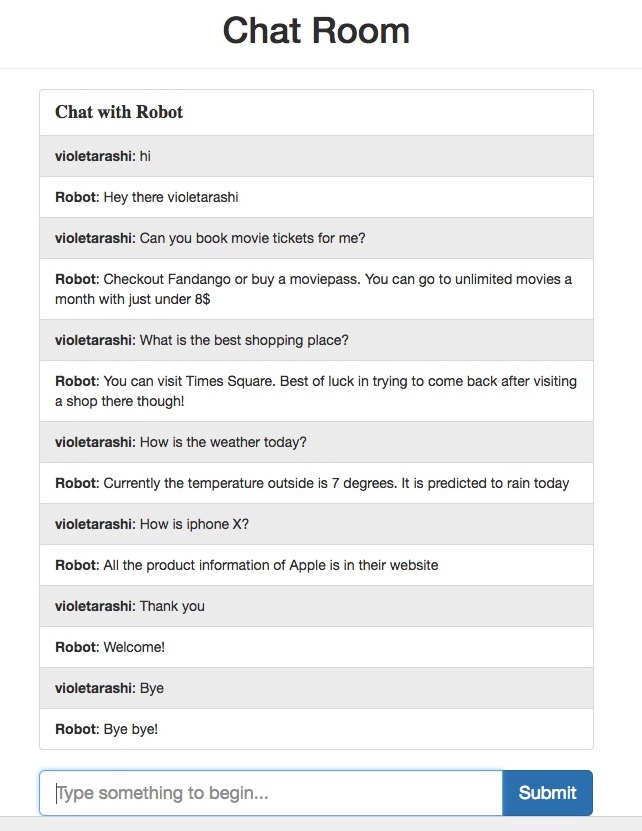

# Chat Robot
This is a serverless, microservice-driven chat robot

# Tech
AWS, AWS API gateway with CORS, AWS Lambda, AWS Cognito, AWS IAM, AWS S3, Swagger API 

## Team ID: 1
1. Siao-Ting Wang(sw3092)
2. Sriharsha Sammeta(vs2626)

## User Guide
 
 

## Usecases
1. Hi
2. Some movie information
3. Some shopping information
4. Some iPhone information
5. Bus information
6. Weather information
7. Thanks
8. Bye
9. Others

## Example Sentences
1. Hi how are you?
2. can you book movie tickets for me?
3. what is the best shopping place?
4. How is iphone X?
5. Book bus tickets
6. How is the weather today?
7. Thank you
8. Bye
9. Some sentence 

## License

    Copyright 2015 Siao-Ting Wang

    Licensed under the Apache License, Version 2.0 (the "License");
    you may not use this file except in compliance with the License.
    You may obtain a copy of the License at

       http://www.apache.org/licenses/LICENSE-2.0

    Unless required by applicable law or agreed to in writing, software
    distributed under the License is distributed on an "AS IS" BASIS,
    WITHOUT WARRANTIES OR CONDITIONS OF ANY KIND, either express or implied.
    See the License for the specific language governing permissions and
    limitations under the License.
