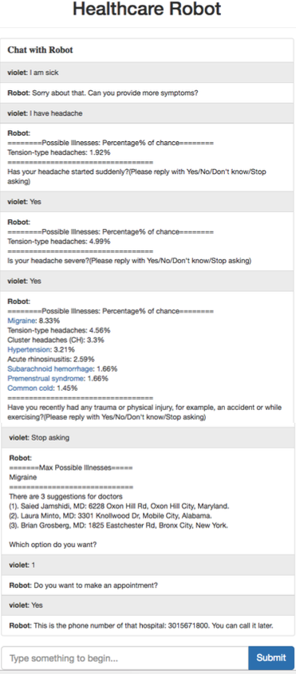

# Chat Robot
Our project aims to create a healthcare bot which can collect
users’ information and translate it into useful data for
medical usage. Besides, it can also provide some diagnoses
while the user is uncomfortable. Therefore, we provide the
following features: First, the bot needs to collect users’ personal
information for further analysis, such as weight and
daily diet. Second, the bot needs to analyze the symptoms
by communicated with the users and provide they 3 nearest
doctors who specialize in the treatment of those symptoms.
Third, the bot can generate a symptoms report using the
information collected from the user, such as symptoms and
eating habits. Then it should email all the information to
the user. Forth, The bot can provide the translation between
food and calories. It even can provide the meal suggestions
according to the users’ preference. Finally, the bot can analyze
the user’s weight and daily meal to provide some weight
control suggestions.

# Tech

## Team ID: 32
1. Siao-Ting Wang(sw3092)    => Backend Setup/Health Diagnostics/Calories Controller/Web Scraping
2. Sriharsha Sammeta(vs2626) => Food Suggestions

## User Guide
 Health Diagnostics
 ----
  

 Web Scraping
 ----
  

 Calories Controller
 ----
  

 Food Suggestions
 ----
  

## Notes

## License

    Copyright 2015 Siao-Ting Wang

    Licensed under the Apache License, Version 2.0 (the "License");
    you may not use this file except in compliance with the License.
    You may obtain a copy of the License at

       http://www.apache.org/licenses/LICENSE-2.0

    Unless required by applicable law or agreed to in writing, software
    distributed under the License is distributed on an "AS IS" BASIS,
    WITHOUT WARRANTIES OR CONDITIONS OF ANY KIND, either express or implied.
    See the License for the specific language governing permissions and
    limitations under the License.
